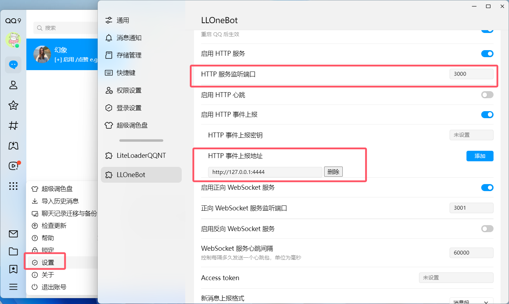
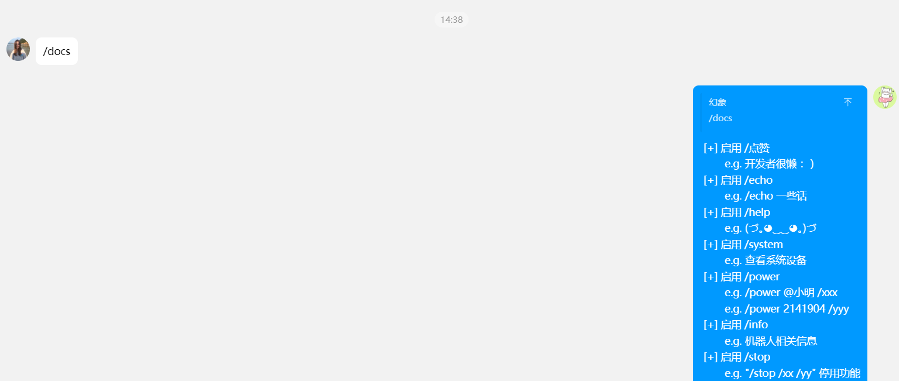

# iQQbot
搭建的一个 QQ 机器人框架.

## 第一步：

> 安装 LLOneBot 脚手架。

## 第二步：

> 设置源代码的 `configs/init.json` 文件配置信息，包括：`HTTP 监听端口`、`HTTP 事件上报地址`、`QQ 机器人账号`、`主人的账号`。

## 第三步：

> 运行 `main.py` 入口程序，并尝试向 QQ 机器人账号发送 `/docs`、`/help`、`/info` 等指令。

